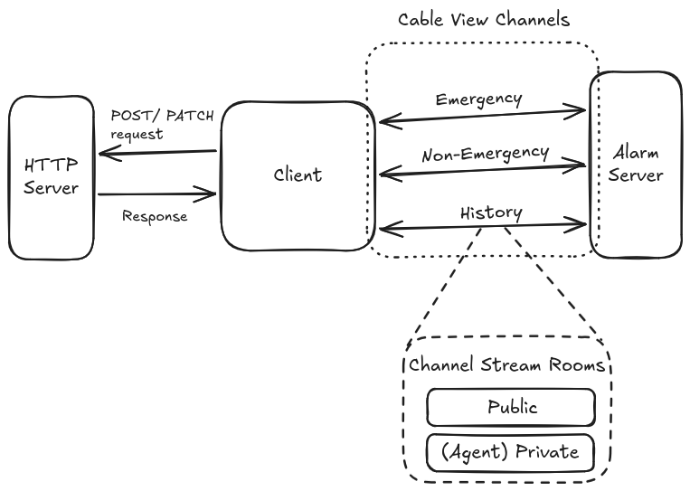
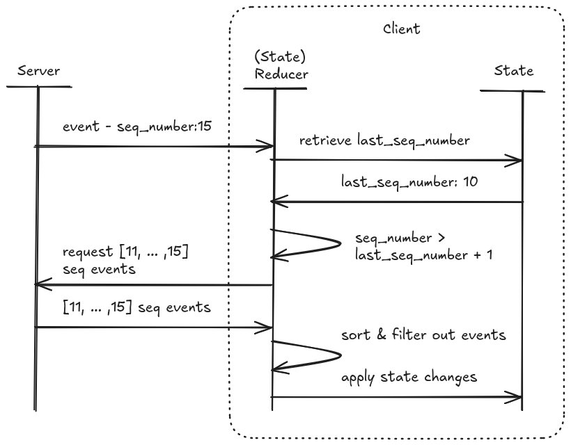

# Design Memo: Real Time and Concurrent Alarm Control Frontend System

Author: Adilson Sandoval
Last update: 25.02.2026

## Goals / Non-Goals

### Goals

1. Real-time consistency
2. Concurrency (multi-agent edits)
3. Performance under high update frequency
4. Failure handling and reconnect strategies

### Non-Goals

- Define UI state framework or APIs to use
- Persistence of alarm state across user sessions and offline support
- Handling multiple sessions per agent
- Client authentication
- Handle different server schema version
- User Experience around alarm list components. More context is required.

## Proposed Architecture

## Goals Decisions Summary

1. Real-time consistency

    - Action Cable, unique alarm id, last updated wins, recovery on alarm gap detection

2. Concurrency (multi-agent edits)

    - Broadcast atomic alarm state changes, re-broadcast alarm events, reactive UI to events by other agents

3. Performance under high update frequency

    - Optimistic UI, reactive UI to only partial state changes, sort new alarms by binary-search insert algorithm

4. Failure handling and reconnect strategies

    - Action Cable inbuilt autoconnect, alarm gap detection by sequential event number, partial UI functionality

### Client Server Communication



Make use of Rails' Action Cable as it provides dual communication, low latency, and inbuilt detection of connection issues.

Server should provide three channels, one per Alarm stack (Emergency, Non-Emergency, History). This gives Agents the flexibility to select which stacks to subscribe. It also enables the system to provide partial communication.

Each channel should provide two stream "rooms" per client. A "Public" one where alarm events are broadcasted to every subscriber and an "Agent-Private" one where agents can request and receive missed alarm events (gap detection).

#### Server Messages

Server should broadcast the following Alarm message for any type of event (created, updated, closed) or requested by gap detection

```ts
{
  "type": "created" | "updated" | "closed",
  "seq_number": number,
  "emitted_at": string,
  "alarm": {
    "id": string
    "priority": number
    "stack": "emergency" | "non_emergency" | "history"
    "status": "open" | "assigned" |"in_progress" | "closed", // see a lower section for alarm status descriptions
    "assigned_agent_id": string | null,
    "created_at": string,
    "updated_at": string,
  }
}
```

Data should be full entity instead of patch, as the amount of data per alarm is low and reduces complexity to merge data in the client side. Server is the source of truth.

Server should provide a sequential number per alarm event (`seq_number`), an increased index, that will allow the client to detect if an alarm was missed in the broadcast.

The `"assigned"` value in `alarm.status` along with `alarm.assigned_agent_id` will allow the client to identify if an alarm has been assigned to another agent and reduce the possibility of two agents working in the same alarm. An alarm is 'assigned' to an agent when they open the alarm to dispatch an action.

#### Client Messages

Client should send two types of messages depending if it's to inform of an alarm update or to request alarm data due to gap detection.

In the "public" rooms, client should send the following message type:

```ts
{
  "type": "updated" | "closed",
  "alarm": {
    "id": string
    "status": "assigned" | "in_progress" | "closed", // see a lower section for alarm status descriptions
    "assigned_agent_id": string | null,
    "updated_at": string,
  }
}
```

Client is allowed to provide a tentative update time value to the alarm, but it will be the server who decides to keep it or replace it.

Server should re-broadcast "public" room messages with Alarm full entities to all the subscribed Agents.

In the "Agent-Private" room, client should send the following message type to request alarm data:

```ts
{
  "type": "request_alarms",
  "seq_numbers": number[],
}
```

Server should respond with a series of Alarm data messages that not necessarily should follow a sequential order or even cover all the requested alarms. Client should handle the fulfillment status of its request.

#### Alarm Status Descriptions

An alarm should have one of the following disjoint status at any time:

- "open": An alarm has just been created or it is not in any of the remaining states.
- "assigned": An agent has focused in the alarm (opened a popup, detailed alarm window, etc).
- "in_progress": An agent has dispatched an action on the alarm and is waiting for the response.
- "closed": An alarm shouldn't be able to recover from a 'closed' state

### Client State Structure and Update

We should use a normalized (flat and non-duplicated) state structure around our alarm data in order to reduce time in sorting and access to state.

As an agent is expected to interact with one stack at a time, and the data channels are also per stack, we should instantiate a group of states per stack, allowing us to optimize performance in cases like alarm sorting or list rendering.

The alarm state per stack should contain the following:

```ts

{
  alarms_by_id: Record<string, Alarm>,
  sorted_alarm_ids: string[], // from higher priority to lower


  // handling alarm event gaps
  last_seq_number: number,
  pending_seq_numbers: number[], // this is used if gaps couldn't be filled in the first attempt
}

```

A higher level state in the app should contain the current active stack:

```ts
{
  activeStack: "emergency" | "non_emergency" | "history",
}
```

To update the state around alarms, we should use a state reducer pattern to facilitate modularization and a clean state update.

#### Alarms Events

New alarms are detected by client doing a fast alarm ID check. After storing it, we should trigger a fast sort injection. See "Expensive Actions" mitigation section below.

Alarm updates are only considered if they are not outdated (checking `alarm.update_at`). A trigger on alarm sorting happens only if there's a change in one of the alarm characteristics that affects its sort order (see "Alarm Prioritization" section below).

If we receive a "closed" alarm event, we should remove the alarm from the `alarms_by_id` and the `sorted_alarm_ids`.

For any of the previous events we should do a gap detection check and react to it (see mitigation section below).

Alarm duplication shouldn't happen due to the unique alarm id values that we are storing and our reactive UI linked to them.

### Alarm Prioritization

The prioritization order that we should follow per alarm stack is the following (from first to compare to last):

- Priority value
- Creation date
- Being assigned to an agent

As each stack is independent (data source and UI state), it will be up to the user experience to decide how to use alarm prioritization to represent the items in a stack.

Server shouldn't have a saying on how the client will sort the alarms.

## Failure modes + mitigation

### Gap Detection

Alarm event gaps can happen as there's no guarantee on order for server messages or if the server send messages while the client suffers a disconnection.

The way that we will detect a gap is due to the server providing a sequential alarm event number (`seq_number`) and compare it against a local value (`last_seq_number`). We will trigger gap detection check in every alarm message we receive.



If we detect that there's a positive gap (`seq_number` > `last_seq_number` + 1), we will do the following:

1. Request the server, in the "Agent-Private" room, for all the missed alarms in the gap and store the request sequential numbers (`pending_seq_numbers`).
2. Update `last_seq_number` to reflect the value of `seq_number` as we don't need to compare them anymore.
3. React to all the alarm events we receive in the "Agent-Private" room like we do in the "Public" room. Clear them from `pending_seq_numbers`.
4. Initialize an exponential time interval to keep requesting for alarm events that are still in `pending_seq_numbers`. Clear the interval when appropriate.

### Connectivity Issues

Action Cable supports disconnect event detction and autoconnect out of the box.

To recover from a disconnection, running a gap detection (see previous section) should be able to retrieve missed alarm events.

Ghosted alarms (closed alarms while disconnected) should be handled by the previous logic.

Agents should be notified at all times when a channel (alarm stack) connection has been lost. Even if there's no streaming, reacting to an alarm is a high priority action, we should allow the Agent to interact with an stream-offline UI and react to the alarm (POST/PATCH requests). When stream connection restores, we should send the update to the server and the server should decide which state to keep and broadcast.

Server should be allowed to remove the "assigned" alarm status for a client that has beeen disconnected for too long. Client should be notified of the change when reconnects.

As we are following an optimist UI approach, we should reflect to the agent that optimistic state until we receive a response from the HTTP method.

### Expensive Actions

As Cable Action communication is expected to be under 20ms of latency per message, the possible bottleneck could happen in the client side and specifically with actions like alarm sorting, list rendering, state sync with third-party servers (POST/PATCH actions).

To mitigate an expensive re-sort alarm action, we will use binary-search insert algorithm with every new or (if needed) updated alarm we receive. This along with the alarm stack groups that act as a hash table should avoid an expensive sort.

For list rendering, if the framework doesn't allow it, we can batch states and flush them at fixed time interval through react APIs (useTransition). Also, we can use UX techniques to handle long list of items and render a minimum amount: pagination, split list sections (hot list and full list).

For state synchronization through HTTP methods, we will follow an optimistic approach: we will update the alarm as if the HTTP response was successful and, if needed, amend it after we received the response with an UI update and server notification.

## Observability

We should be able to measure the following metrics:

1. Alarm transmission latency

    - With `alarm.emitted_at` value provided by the server and a call to `Date.now()` when agent receives the alarm

2. Alarm render latency

    - Comparing the time between alarm being received by an agent and the moment the alarm UI element finishes rendering, if it applies as we won't render everything we receive.

3. Frequency of alarm gaps per agent

    - Value can be accumulated from the gap elements we detect in our gap detection
    - This metric can be used to observe the health of the stream.

To keep track of the <1s stack freshness we can observe the alarm transmission and render latency metrics.

All these metrics can stay in the client side and communicated to a telemetry server when appropriate.

## Trade-offs

1. Client/server communication

    - Chosen: Action Cable
    - Upsides: Rails native, low latency, flexibility on channel subscription
    - Downsides: losing broadcasted messages on disconnection, messages order is not guaranteed
    - Alternatives: Server Sent Events (SSE), GraphQL Subscriptions

2. Gap detection

    - Chosen: Server provides a sequential event number per event
    - Upsides: Easy to implement and track from the server and client side.
    - Downsides: There's no guarantee that server will skip numbers in the sequence. Gap reconciliation needs to handle it.
    - Alternatives: Server keeps track of events received per agent

3. Real time concurrency

    - Chosen: Server re-broadcasts atomic state change events from all agents and last updated wins.
    - Upsides: Low latency, collaborative friendly, simple to implement from server side
    - Downsides: Complexity is in the client side to determine which state to keep or ignore.
    - Alternatives: Clients request changes to server and wait until server decides the correct state.

4. Prioritization around "Emergency" alarms

    - Chosen: Separate broadcast channels and UI states per alarm stack
    - Upsides: Allows flexibility on user experience and performance
    - Downsides: Possibility of code duplication if not handled properly
    - Alternatives: Adding a priority weight to emergency alarms

## Assumptions

- We don't want agents to work in the same alarm at the same time.
- There's no clarity around who can close an alarm: only agents or also server. Current solution covers both.
- Server is capable to remember past alarm events.
